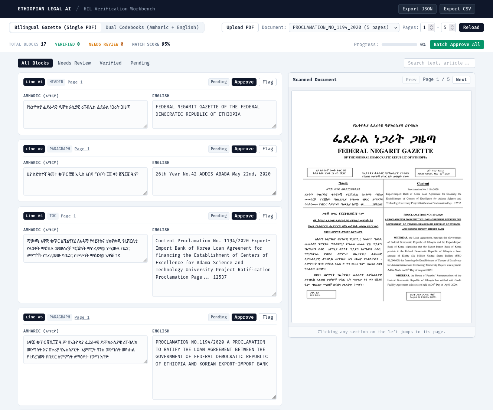
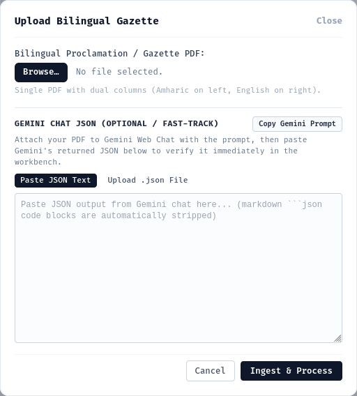

# GAZZI - Human-in-the-Loop Alignment Pipeline

A human-in-the-loop (HIL) alignment tool for Ethiopian legal documents (Negarit Gazettes and bilingual codebooks). It extracts parallel Amharic and English legal texts, aligns them by article or section, and provides a web workbench for visual review against the original scanned PDF pages.

---

<!-- Main Workbench Screenshot Placeholder -->
<p align="center">
  
</p>
<!-- Replace docs/screenshots/workbench.png with your screenshot of the side-by-side review workbench -->

---

## Features

- **Bilingual Gazette Alignment**: Splits dual-column Negarit Gazettes (Amharic on the left, English on the right) and pairs corresponding clauses.
- **Dual Codebook Alignment**: Pairs separate Amharic and English PDF volumes by article number and heading structure.
- **Synchronized Visual Verification**: Clicking any text pair in the editor highlights and jumps to the exact source page in the scanned PDF viewer.
- **Fast-Track Gemini Chat Workflow**: Don't have an API key? Copy the built-in prompt, paste your PDF into Gemini web chat, and drop the returned JSON directly into the upload dialog.
- **Audit & Quality Checks**: Flags length divergence, empty counterparts, and potential OCR noise with match scores.
- **Corpus Export**: Export verified parallel pairs to structured JSON or CSV for model training.

---

## Screenshots

| Verification Workbench | Gemini Fast-Track Upload |
|---|---|
|  |  |
| *Side-by-side bilingual editor & page preview* | *One-click prompt copy & JSON paste* |

<!-- 
Drop your screenshots into docs/screenshots/:
- docs/screenshots/workbench.png
- docs/screenshots/upload_modal.png
-->

---

## Getting Started

### Prerequisites
- Python 3.10+
- Node.js 18+ and `pnpm`
- (Optional) `tesseract-ocr` with `tesseract-ocr-amh` for local scanned OCR fallback

### 1. Backend Setup

```bash
# Set up Python virtual environment
python3 -m venv .venv
source .venv/bin/activate

# Install dependencies
pip install -r requirements.txt

# Start backend server (runs on http://127.0.0.1:8000)
uvicorn app.main:app --reload --port 8000
```

### 2. Frontend Setup

```bash
# Install frontend packages
pnpm install

# Start Vite dev server (runs on http://localhost:5173)
pnpm dev
```

Open `http://localhost:5173` in your browser.

---

## Workflows

### Option A: Gemini Chat Fast-Track (No API Key Required)
1. In the workbench, click **Upload PDF**.
2. Click **Copy Gemini Prompt** to copy the tailored extraction prompt to your clipboard.
3. Open [gemini.google.com](https://gemini.google.com), attach your PDF, and paste the prompt.
4. Paste the resulting JSON block into the upload dialog (or upload the `.json` file) and click **Ingest & Process**.
5. Review and verify the pairs side-by-side with the scanned PDF pages.

### Option B: Automated API Extraction
If you have an API key, copy `.env.example` to `.env`:
```bash
cp .env.example .env
```
Set `GEMINI_API_KEY` (or `OPENAI_API_KEY`). Documents uploaded without precomputed JSON will be processed automatically using multimodal vision models.

### Option C: Drop-in Precomputed Files
Place matching PDF and JSON files directly into `data/precomputed/`:
```text
data/precomputed/
├── proclamation_1194.pdf
└── proclamation_1194.json
```
They will appear automatically in the document dropdown on page reload.

---

## CLI Runner

You can also run extraction directly from the terminal:

```bash
python run_pipeline.py --mode gazette --pdf data/precomputed/PROCLAMATION_NO_1194_2020.pdf --pages 1 3
```
